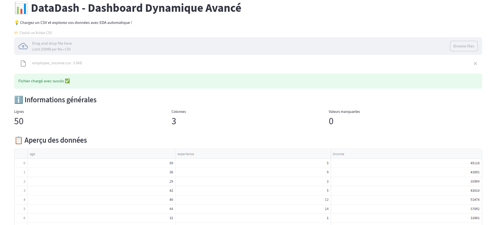
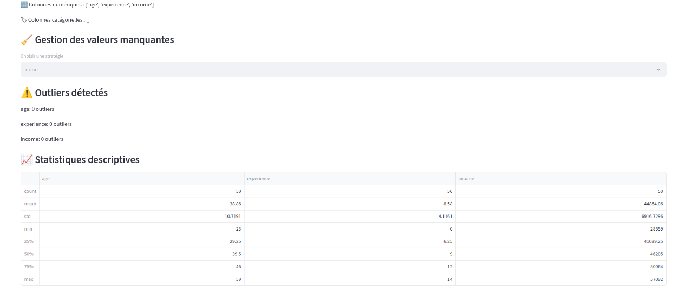
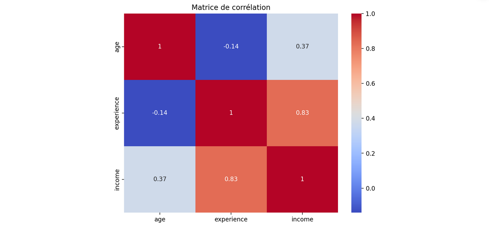
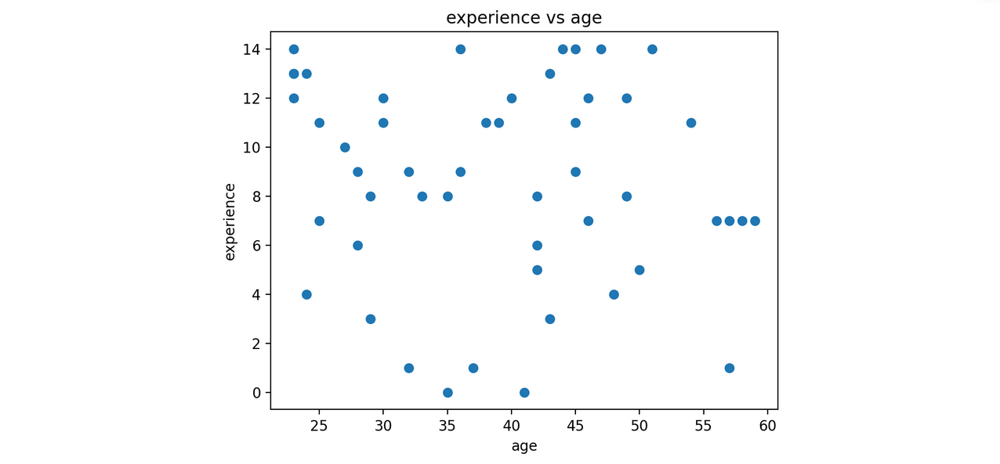

# 📊 DataDash - Dashboard Dynamique Avancé

## 🎯 Objectif
DataDash est une application interactive en Streamlit permettant l'exploration automatique des données (EDA) à partir de fichiers CSV.

## 🧠 Contexte
Ce projet démontre la maîtrise de la manipulation de données, visualisation et bonnes pratiques Python pour l'IA && Data Science.

##Technologies
- Python
- Streamlit
- Pandas
- NumPy
- Matplotlib
- Seaborn

##Fonctionnalités
- Upload CSV interactif
- Gestion avancée des valeurs manquantes (drop, mean, median, mode)
- Détection des outliers
- Statistiques descriptives
- Visualisations : histogrammes, scatter, boxplots, corrélation
- Filtrage interactif des données
- Export CSV filtré


Voici à quoi ressemble DataDash avec un dataset exemple :









##Installation

```bash
git clone <lien_repo>
cd DataDash
python -m venv venv
source venv/bin/activate
pip install -r requirements.txt
streamlit run app.py

